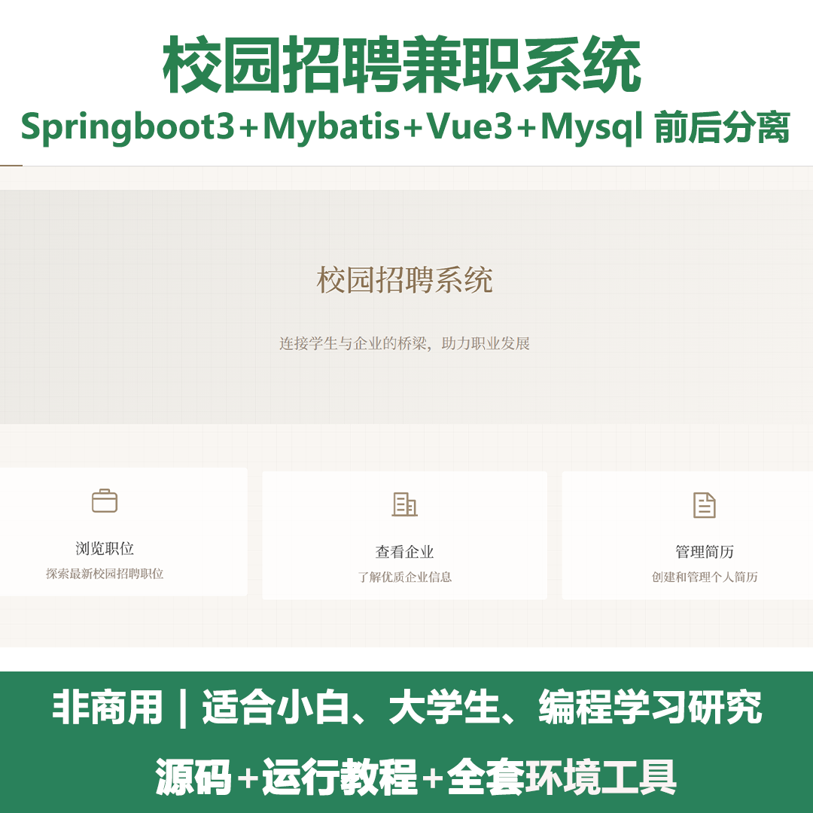
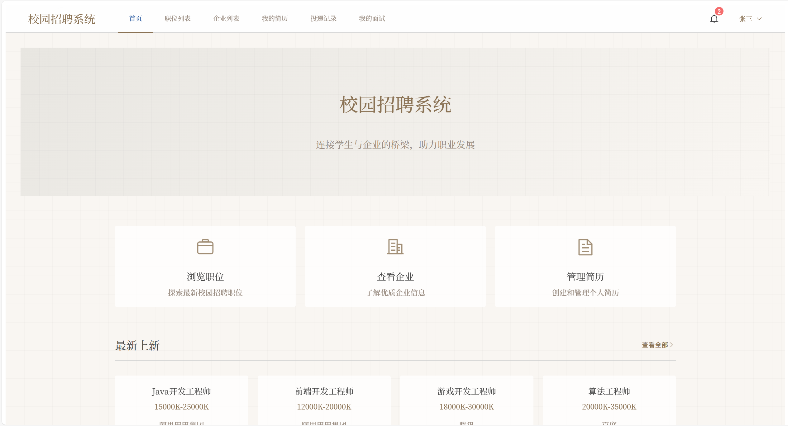
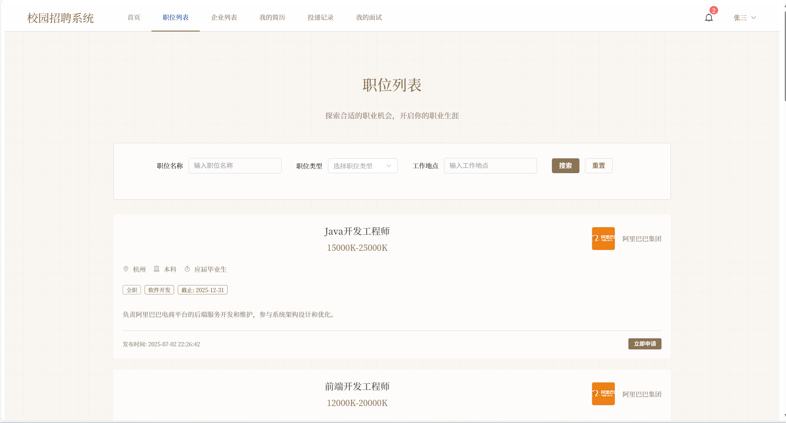
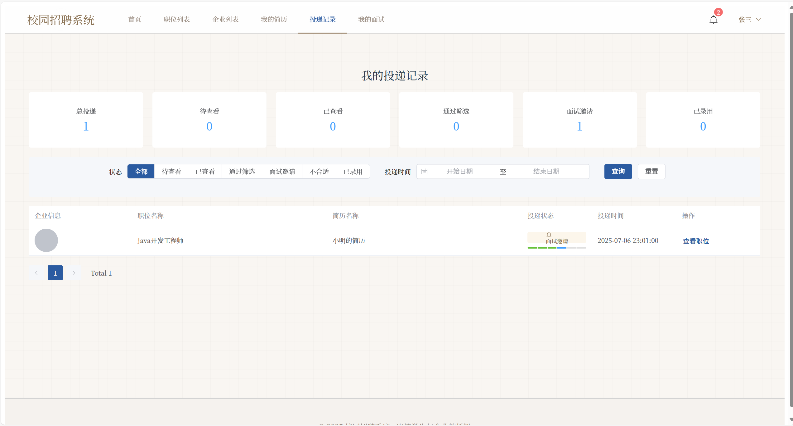
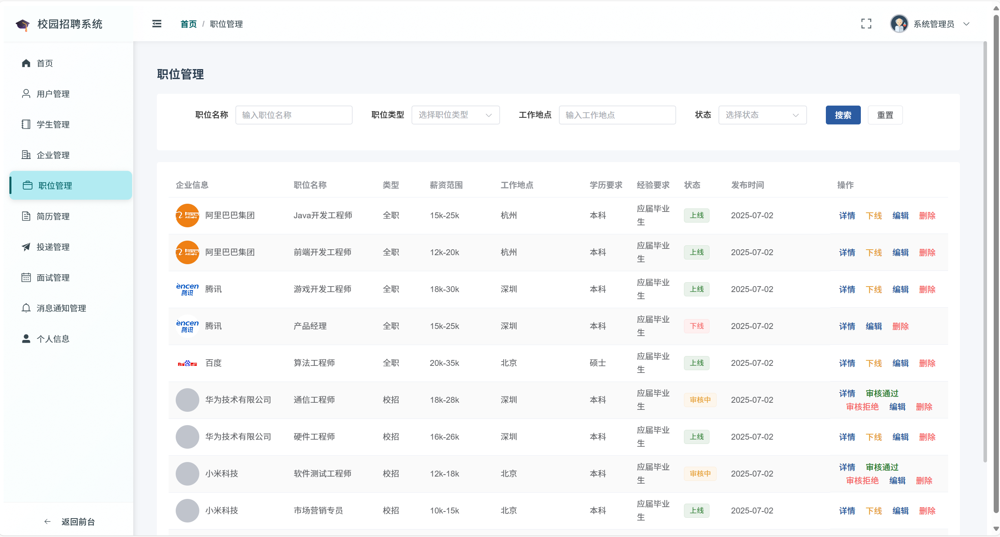
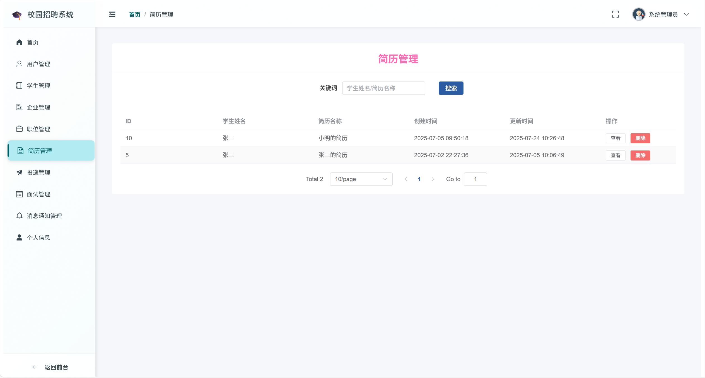
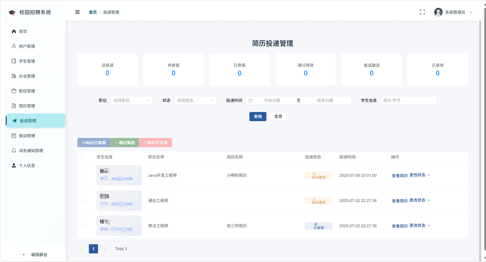
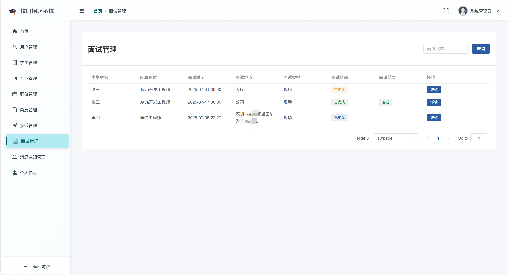

# springbootA547
springbootA547校园招聘兼职系统（Vue3）
 
## 源码问题查看主页咨询

### 一、关键词
校园招聘兼职系统，校园兼职招聘平台，校园兼职招聘管理系统

### 二、作品包含
源码+数据库+全套环境和工具资源+本地部署教程

### 三、项目技术
前端技术：vue/element-plus/nodejs/axios/pinia/vite
后端技术：springboot/mybatisplus/jwt/SpringSecurity/SpringAi

### 四、运行环境（以下版本亲测，其他版本兼容性请自行测试）
开发工具：IDEA/eclipse  + VSCODE

数据库：MySQL8

数据库管理工具：Navicat10以上版本

环境配置软件： JDK17 + Maven3.6.3

前端Nodejs：20

浏览器：谷歌浏览器

### 五、项目介绍
项目编号：springbootA547

用户模块：用户登录；用户增删改查；密码修改；密码重置；用户增删改查;
企业模块：企业信息增删改查；根据用户ID查询企业信息；分页查询企业信息；更新企业认证状态；检查用户是否已有企业信息；获取当前用户的企业信息
职位模块：职位增删改查；职位发布；更新职位状态；分页查询职位列表；获取企业职位列表；获取职位详情
简历模块：简历增删改查；设置默认简历；上传简历附件；简历预览；管理员分页查询所有简历；
简历投递模块：投递简历；获取学生投递列表；获取企业收到的投递列表；更新投递状态；获取投递统计信息
面试模块：创建面试邀请；确认面试；完成面试；取消面试；获取面试详情；企业端分页查询面试列表；学生端分页查询面试列表
消息模块：发送消息；批量发送消息；根据角色批量发送消息；分页查询消息；获取消息详情；标记消息为已读；批量标记消息为已读；标记所有消息为已读；删除消息；批量删除消息；获取消息统计
文件模块：文件上传；多文件上传
仪表盘模块：获取统计数据；获取申请趋势；获取职位类别分布

### 六、运行截图

 
